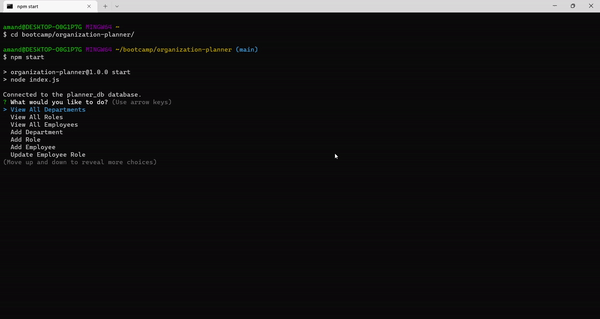

# Organization Planner

## Description

This organization planner helps you to create and maintain your organizations structure. You can add departments, roles, employess and view them all. The application utilizes JavaScript and MySQL. 

## Installation

You can access the organization planner by cloning the repo. 

## Usage

Below is a screen recording of the completed organization planner and its functionality.

## Credits

Thanks to [w3schools](https://w3schools.com) and [MDN Web Docs](https://developer.mozilla.org/en-US/) for JavaScript tutorials. [ezgif](https://ezgif.com) was used to convert the screen recording into a gif.

## License

Please refer to the LICENSE in the repo.
